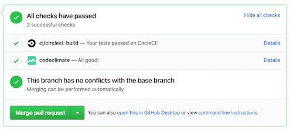

# Ruby Connect-4

### Overview

Creating the game engine for connect-4 via
[Bitboards](https://github.com/denkspuren/BitboardC4/blob/master/BitboardDesign.md)
in Ruby.

The above Bitboards link is to a high level discussion on how
to use Bitboards via psudo-code. When searching the internets
I didn't find an example written in Ruby. 

This is that example.

### Next Steps

I'd like to use this code as the backend to an actual connect-4
game created with a front-end in something like [Vue.js](https://vuejs.org/) 
or [React](https://reactjs.org/) as an exercise to become more familiar with 
either of those technologies.

### Stack

* Ruby 2.6.3
* RSpec (testing)
* Rubocop (linter)

### Getting Started

**Game Engine**

* [app/lib/bitboard.rb](app/lib/bitboard.rb)

**Setup**

* `bundle install`

**Run Tests**

* `bundle exec rspec -f d`

**Run Robocop (linter, etc...)**

* `bundle exec rubocop`

**[Pull Requests](https://github.com/ChrisDrit/connect-4/pulls)**

* CircleCI integration for automated testing (RSpec).
  
*  CodeClimate integration for Code Style (Rubocop).
  
    
